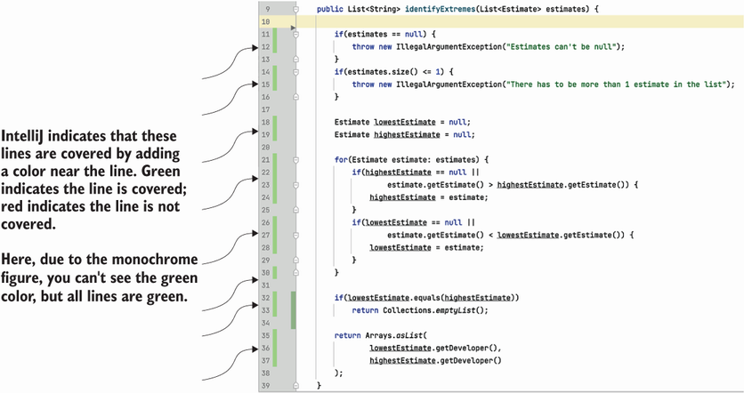
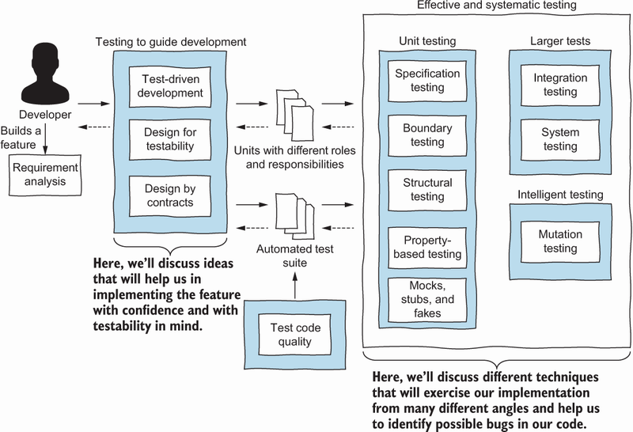
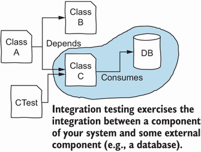
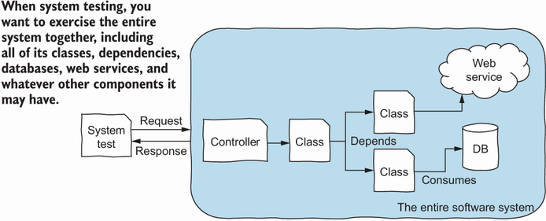
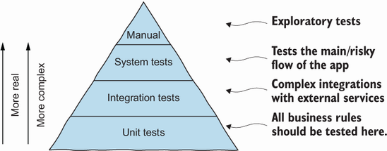

# Effective Software Testing

By Mauricio Aniche
- April 2022
- Manning Publications
- ISBN: 9781633439931

Brief contents:
1. Effective and systematic software testing
2. Specification-based testing
3. Structural testing and code coverage
4. Designing contracts
5. Property-based testing
6. Test doubles and mocks
7. Designing for testability
8. Test-driven development
9. Writing larger tests
10. Test code quality
11. Wrapping up the book

# Preface

Every software developer remembers a specific bug that affected their career. Let me tell you about mine. In 2006, I was the technical lead for a small development team that was building an application to control payments at gas stations. At the time, I was finishing my computer science undergraduate studies and beginning my career as a software developer. I had only worked on two serious web applications previously. And as the lead developer, I took my responsibility very seriously.

The system needed to communicate directly with gas pumps. As soon as a customer finished refueling, the gas pump notified our system, and the application started its process: gathering information about the purchase (type of fuel, quantity in liters), calculating the final price, taking the user through the payment process, and storing the information for future reporting.

The software system had to run on a dedicated device with a 200 MHz processor, 2 MB of RAM, and a few megabytes of permanent storage. This was the first time anyone had tried to use the device for a business application. So, there was no previous project from which we could learn or borrow code. We also could not reuse any external libraries, and we even had to implement our own simplistic database.

The system required refuelings, and simulating them became a vital part of our development flow. We would implement a new feature, run the system, run the simulator, simulate a few gas purchases, and manually check that the system responded correctly.

After a few months, we had implemented the important features. Our (manual) tests, including tests performed by the company, succeeded. We had a version that could be tested in the wild! But real-world testing was not simple: an engineering team had to make physical changes at a gas station so the pumps could talk to our software. To my surprise, the company decided to schedule the first pilot in the Dominican Republic. I was excited not only to see my project go live but also to visit such a beautiful country.

I was the only developer who traveled to the Dominican Republic for the pilot, so I was responsible for fixing any last-minute bugs. I watched the installation and followed along when the software ran for the first time. I spent the entire day monitoring the system, and everything seemed fine.

That night we went out to celebrate. The beer was cold, and I was proud of myself. I went to bed early so I would be ready to meet the stakeholders the next morning and discuss the project’s next steps. But at 6:00 a.m., my hotel telephone rang. It was the owner of the pilot gas station: “The software apparently crashed during the night. The night workers did not know what to do, and the gas pumps were not delivering a single drop of fuel, so the station could not sell anything the entire night!” I was shaken. How could that have happened?

I went straight to the site and started debugging the system. The bug was caused by a situation we had not tested: more refuelings than the system could handle. We knew we were using an embedded device with limited memory, so we had taken precautions. But we never tested what would happen if the limit was reached—and there was a bug!

Our tests were all done manually: to simulate refueling, we went to the simulator, clicked a button on a pump, started pumping gas, waited some number of seconds (on the simulator, the longer we waited, the more liters of fuel we purchased), and then stopped the refueling process. If we wanted to simulate 100 gas purchases, we had to click 100 times in the simulator. Doing so was slow and painful. So, at development time, we tried only two or three refuelings. We probably tested the exception-handling mechanism once, but that was not enough.

The first software system for which I was the lead developer did not even work a full day! What could I have done to prevent the bug? It was time for me to change how I was building software—and this led me to learn more about software testing. Sure, in college I had learned about many testing techniques and the importance of software testing, but you only recognize the value of some things when you need them.

Today, I cannot imagine building a system without building an automated test suite along with it. The automated test suite can tell me in seconds whether the code I wrote is right or wrong, so I am much more productive. This book is my attempt to help developers avoid the mistakes I made.

# Chapter 1. Effective and systematic software testing

This chapter covers

- Understanding the importance of effective, systematic testing
- Recognizing why testing software is difficult and why bug-free systems do not exist
- Introducing the testing pyramid

The developer community no longer needs to argue about the importance of software testing. Every software developer understands that software failures may cause severe damage to businesses, people, or even society as a whole. And although software developers once were primarily responsible for building software systems, today they are also responsible for the quality of the software systems they produce.

Our community has produced several world-class tools to help developers test, including JUnit, AssertJ, Selenium, and jqwik. We have learned to use the process of writing tests to reflect on what programs need to do and get feedback about the code design (or class design, if you are using an object-oriented language). We have also learned that writing test code is challenging, and paying attention to test code quality is fundamental for the graceful evolution of the test suite. And finally, we know what the common bugs are and how to look for them.

But while developers have become very good at using testing tools, they rarely apply systematic testing techniques to explore and find bugs. Many practitioners argue that tests are a feedback tool and should be used mostly to help you develop. Although this is true (and I will show throughout this book how to listen to your test code), tests can also help you find bugs. After all, that is what software testing is all about: *finding bugs*!

Most developers do not enjoy writing tests. I have heard many reasons: writing production code is more fun and challenging, software testing is too time-consuming, we are paid to write production code, and so on. Developers also overestimate how much time they spend on testing, as Beller and colleagues found in a nice empirical study with hundreds of developers in 2019. My goal with this book is to convince you that
1. as a developer, it is **your** responsibility to ensure the quality of what you produce;
2. that tests are the only tools to help you with that responsibility; and
3. that if you follow a collection of techniques, you can test your code in an effective and systematic way.

Note the words I used: *effective and systematic*. Soon you will understand what I mean. But first, let me convince you of the necessity of tests.

## 1.1 Developers who test vs. developers who do not

It is late on Friday afternoon, and John is about to implement the last feature of the sprint. He is developing an agile software management system, and this final feature supports developers during planning poker.

#### Planning poker

*Planning poker* is a popular agile estimation technique. In a planning poker session, developers estimate the effort required to build a specific feature of the backlog. After the team discusses the feature, each developer gives an estimate: a number ranging from one to any number the team defines. Higher numbers mean more effort to implement the feature. For example, a developer who estimates that a feature is worth eight points expects it to take four times more effort than a developer who estimates the feature to be worth two points.

The developer with the smallest estimate and the developer with the highest estimate explain their points of view to the other members of the team. After more discussion, the planning poker repeats until the team members agree about how much effort the feature will take. You can read more about the planning poker technique in *Kanban in Action* by Marcus Hammarberg and Joakim Sundén (2014).

John is about to implement the feature’s core method. This method receives a list of estimates and produces, as output, the names of the two developers who should explain their points of view. This is what he plans to do:

- *Method*: `identifyExtremes`

The method should receive a list of developers and their respective estimates and return the two developers with the most extreme estimates.

- *Input*: A list of Estimates, each containing the name of the developer and their estimate
- *Output*: A list of `String`s containing the name of the developer with the lowest estimate and the name of the developer with the highest estimate

Listing 1.1 The first `PlanningPoker` implementation

```java
public class PlanningPoker {
  public List<String> identifyExtremes(List<Estimate> estimates) {
 
    Estimate lowestEstimate = null;                                ❶
    Estimate highestEstimate = null;                               ❶
 
    for(Estimate estimate: estimates) {
 
      if(highestEstimate == null ||
       estimate.getEstimate() > highestEstimate.getEstimate()) {   ❷
        highestEstimate = estimate;
      }
      else if(lowestEstimate == null ||
       estimate.getEstimate() < lowestEstimate.getEstimate()) {    ❸
        lowestEstimate = estimate;
      }
 
    }
 
    return Arrays.asList(                                          ❹
        lowestEstimate.getDeveloper(),
        highestEstimate.getDeveloper()
    );
  }
}
```

1. Defines placeholder variables for the lowest and highest estimates
2. If the current estimate is higher than the highest estimate seen so far, we replace the previous highest estimate with the current one.
3. If the current estimate is lower than the lowest estimate seen so far, we replace the previous lowest estimate with the current one.
4. Returns the developers with the lowest and the highest estimates

The logic is straightforward: the algorithm loops through all the developers in the list and keeps track of the highest and lowest estimates. It returns the names of the developers with the lowest and highest estimates. Both `lowestEstimate` and `highestEstimate` are initialized with `null` and later replaced by the first estimate within the `for` loop.

#### Generalizing from the code examples

Experienced developers may question some of my coding decisions. Maybe this `Estimate` class is not the best way to represent developers and their estimates. Maybe the logic to find the smallest and highest estimates is not the best. Maybe the if statements could be simpler. I agree. But my focus in this book is not object-oriented design or the best ways to write code: rather, I want to focus on how to test the code once it’s written.

The techniques I show you throughout this book will work regardless of how you implement your code. So, bear with me when you see a piece of code that you think you could do better. Try to generalize from my examples to your own code. In terms of complexity, I am sure you have encountered code like that in listing 1.1.

John is not a fan of (automated) software testing. As is commonly done by developers who do not automate their tests, John runs the finished application and tries a few inputs. You can see one of these trials in figure 1.1. John sees that given the input in the figure (the estimates of Ted, Barney, Lily, and Robin), the program produces the correct output.

| developer | effort    | result
|-----------|----------:|--------
| Ted       | 16        |
| Barney    | 8         |
| Lily      | 2         |
| Robin     | 4         |
|           |           | Lily and Ted should speak up

Figure 1.1 John does some manual testing before releasing the application.

John is happy with the results: his implementation worked from the beginning. He pushes his code, and the new feature is deployed automatically to customers. John goes home, ready for the weekend—but not even an hour later, the help desk starts to get e-mails from furious customers. The software is producing incorrect outputs!

John goes back to work, looks at the logs, and quickly identifies a case where the code fails. Can you find the input that makes the program crash? As illustrated in figure 1.2, if the developers’ estimates are (by chance) in ascending order, the program throws a null pointer exception.


| developer | effort    | result
|-----------|----------:|--------
| Ross      | 2         |
| Phoebe    | 4         |
| Monica    | 8         |
| Chandler  | 16        |
|           |           | null pointer exception

Figure 1.2 John finds a case where his implementation crashes.

It does not take John long to find the bug in his code: the extra `else` in listing 1.1. In the case of ascending estimates, that innocent `else` causes the program to never replace the `lowestEstimate` variable with the lowest estimate in the list, because the previous if is always evaluated to `true`.

John changes the `else if` to an `if`, as shown in listing 1.2. He then runs the program and tries it with the same inputs. Everything seems to work. The software is deployed again, and John returns home, finally ready to start the weekend.

Listing 1.2 The bug fix in the PlanningPoker implementation

```java
if(highestEstimate == null ||
    estimate.getEstimate() > highestEstimate.getEstimate()) {
  highestEstimate = estimate;
}
 
if(lowestEstimate == null ||                                  ❶
    estimate.getEstimate() < lowestEstimate.getEstimate()) {
  lowestEstimate = estimate;
}
```

1. We fixed the bug here by replacing the `else if` with an `if`.

You may be thinking, “This was a very easy bug to spot! I would never make such a mistake!” That may be true. But in practice, it is hard to keep tabs on everything that may happen in our code. And, of course, it is even more difficult when the code is complex. Bugs happen not because we are bad programmers but because we program complicated things (and because computers are more precise than humans can be).

Let’s generalize from John’s case. John is a very good and experienced developer. But as a human, he makes mistakes. John performed some manual testing before releasing his code, but manual testing can only go so far, and it takes too long if we need to explore many cases. Also, John did not follow a systematic approach to testing—he just tried the first few inputs that came to mind. Ad hoc methods like “follow your instincts” may lead us to forget corner cases. John would greatly benefit from

1. a more *systematic* approach for deriving tests, to reduce the chances of forgetting a case; and
2. *test automation*, so he does not have to spend time running tests manually.

Now, let’s replay the same story, but with Eleanor instead of John. Eleanor is also a very good and experienced software developer. She is highly skilled in software testing and only deploys once she has developed a strong test suite for all the code she writes.

Suppose Eleanor writes the same code as John (listing 1.1). She does not do test-driven development (TDD), but she does proper testing after writing her code.

> NOTE: In a nutshell, TDD means writing the tests before the implementation. Not using TDD is not a problem, as we discuss in chapter 8.

Eleanor thinks about what the `identifyExtremes` method does. Let’s say her reasoning is the same as John’s. She first focuses on the inputs of this method: a list of `Estimate`s. She knows that whenever a method receives a list, there are several cases to try: a null list, an empty list, a list with one element, and a list with multiple elements. How does she know that? She read this book!

Eleanor reflects on the first three cases (null, empty, single element), considering how this method will fit in with the rest of the system. The current implementation would crash in these cases! So, she decides the method should reject such inputs. She goes back to the production code and adds some validation code as follows.

Listing 1.3 Adding validation to prevent invalid inputs

```java
public List<String> identifyExtremes(List<Estimate> estimates) {
 
  if(estimates == null) {                                             ❶
    throw new IllegalArgumentException("estimates cannot be null");
  }
  if(estimates.size() <= 1) {                                         ❷
    throw new IllegalArgumentException("there has to be more than 1
    ➥ estimate in the list");
  }
 
  // continues here...
}
```

1. The list of estimates cannot be `null`.
2. The list of estimates should contain more than one element.

Although Eleanor is sure that the method now handles these invalid inputs correctly (it is clear in the code), she decides to write an automated test that formalizes the test case. This test will also prevent future regressions: later, if another developer does not understand why the assertions are in the code and removes them, the test will ensure that the mistake is noticed. The following listing shows the three test cases (note that, for now, I am making the tests verbose so they are easy to understand).

Listing 1.4 Test cases for null, an empty list, and a one-element list

```java
public class PlanningPokerTest {
  @Test
  void rejectNullInput() {
    assertThatThrownBy(                                                  ❶
      () -> new PlanningPoker().identifyExtremes(null)
    ).isInstanceOf(IllegalArgumentException.class);                      ❷
  }
 
  @Test
  void rejectEmptyList() {
 
    assertThatThrownBy(() -> {                                           ❸
      List<Estimate> emptyList = Collections.emptyList();                ❸
      new PlanningPoker().identifyExtremes(emptyList);                   ❸
    }).isInstanceOf(IllegalArgumentException.class);                     ❸
  }
 
  @Test
  void rejectSingleEstimate() {
    assertThatThrownBy(() -> {                                           ❹
      List<Estimate> list = Arrays.asList(new Estimate("Eleanor", 1));   ❹
      new PlanningPoker().identifyExtremes(list);                        ❹
    }).isInstanceOf(IllegalArgumentException.class);                     ❹
  }
}
```

1. Asserts that an exception happens when we call the method
2. Asserts that this assertion is an `IllegalArgumentException`
3. Similar to the earlier test, ensures that the program throws an exception if an empty list of estimates is passed as input
4. Ensures that the program throws an exception if a list with a single estimate is passed

The three test cases have the same structure. They all invoke the method under test with an invalid input and check that the method throws an `IllegalArgumentException`. This is common assertion behavior in Java. The `assertThatThrownBy` method provided by the [AssertJ library](https://assertj.github.io/doc/) enables us to assert that the method throws an exception. Also note the `isInstanceOf` method, which allows us to assert that a specific type of exception is thrown.

If you are not familiar with Java, the lambda syntax `() ->` is basically an inline code block. This may be clearer in the second test, `rejectEmptyList()`, where `{` and `}` delimit the block. The testing framework will run this block of code and, if an exception happens, will check the type of the exception. If the exception type matches, the test will pass. Note that this test fails if the exception is not thrown—after all, having an exception is the behavior we expect in this case.

> NOTE: If you are new to automated tests, this code may make you nervous. Testing exceptions involves some extra code, and it is also an “upside-down” test that passes if the exception is thrown! Don’t worry—the more you see test methods, the better you will understand them.

With the invalid inputs handled, Eleanor now focuses on the *good weather* tests: that is, tests that exercise the valid behavior of the program. Looking back at Eleanor’s test cases, this means passing lists of estimates with more than one element. Deciding how many elements to pass is always challenging, but Eleanor sees at least two cases: a list with exactly two elements and a list with more than two elements. Why two? A list with two elements is the smallest for which the method should work. There is a boundary between a list with one element (which does not work) and two elements (which does work). Eleanor knows that **bugs love boundaries**, so she decides to also have a dedicated test for it, illustrated in listing 1.5.

This resembles a more traditional test case. We define the input value we want to pass to the method under test (in this case, a list with two estimates); we invoke the method under test with that input; and, finally, we assert that the list returns the two developers we expect.

Listing 1.5 Test case for a list with two elements

```java
@Test
void twoEstimates() {
  List<Estimate> list = Arrays.asList(             ❶
      new Estimate("Mauricio", 10),
      new Estimate("Frank", 5)
  );
  List<String> devs = new PlanningPoker()          ❷
    .identifyExtremes(list);
 
  assertThat(devs)                                 ❸
      .containsExactlyInAnyOrder("Mauricio", "Frank");
}
 
@Test
void manyEstimates() {
  List<Estimate> list = Arrays.asList(             ❹
      new Estimate("Mauricio", 10),
      new Estimate("Arie", 5),
      new Estimate("Frank", 7)
  );
 
  List<String> devs = new PlanningPoker()
    .identifyExtremes(list);                       ❺
 
  assertThat(devs)                                 ❻
      .containsExactlyInAnyOrder("Mauricio", "Arie");
}
```

1. Declares a list with two estimates
2. Calls the method we want to test: `identifyExtremes`
3. Asserts that the method correctly returns the two developers
4. Declares another list of estimates, now with three developers
5. Again calls the method under test
6. Asserts that it returns the two correct developers: Mauricio and Arie

Before we continue, I want to highlight that Eleanor has five passing tests, but the `else if` bug is still there. Eleanor does not know about it yet (or, rather, has not found it). However, she knows that whenever lists are given as input, the order of the elements may affect the algorithm. Therefore, she decides to write a test that provides the method with estimates in random order. For this test, Eleanor does not use example-based testing (tests that pick one specific input out of many possible inputs). Rather, she goes for a property-based test, as shown in the following listing.

Listing 1.6 Property-based testing for multiple estimates

```java
@Property                                                                ❶
void inAnyOrder(@ForAll("estimates") List<Estimate> estimates) {         ❷
 
  estimates.add(new Estimate("MrLowEstimate", 1));                       ❸
  estimates.add(new Estimate("MsHighEstimate", 100));                    ❸
 
  Collections.shuffle(estimates);                                        ❹
 
  List<String> dev = new PlanningPoker().identifyExtremes(estimates);
 
  assertThat(dev)                                                        ❺
      .containsExactlyInAnyOrder("MrLowEstimate", "MsHighEstimate");
}

@Provide                                                                 ❻
Arbitrary<List<Estimate>> estimates() {
 
  Arbitrary<String> names = Arbitraries.strings()
      .withCharRange('a', 'z').ofLength(5);                              ❼
 
  Arbitrary<Integer> values = Arbitraries.integers().between(2, 99);     ❽
 
  Arbitrary<Estimate> estimates = Combinators.combine(names, values)
      .as((name, value) -> new Estimate(name, value));                   ❾
 
  return estimates.list().ofMinSize(1);                                  ❿
}
```

1. Makes this method a property-based test instead of a traditional JUnit test
2. The list that the framework provides will contain randomly generated estimates. This list is generated by the method with the name that matches the string "estimates" (declared later in the code).
3. Ensures that the generated list contains the known lowest and highest estimates
4. Shuffles the list to ensure that the order does not matter
5. Asserts that regardless of the list of estimates, the outcome is always `MrLowEstimate` and `MsHighEstimate`
6. Method that provides a random list of estimates for the property-based test
7. Generates random names of length five, composed of only lowercase letters
8. Generates random values for the estimates, ranging from 2 to 99
9. Combines them, thus generating random estimates
10. Returns a list of estimates with a minimum size of 1 (and no constraint for how big the list can be)

In property-based testing, our goal is to assert a specific property. We discuss this in more detail later in chapter 5, but here is a short explanation. The `estimates()` method returns random `Estimate`s. We define that an estimate has a random name (for simplicity, of length five) and a random estimate that varies from 2 to 99. The method feeds lists of `Estimate`s back to the test method. The lists all have at least one element. The test method then adds two more estimates: the lowest and the highest. Since our list only has values between 2 and 99, we ensure the lowest and highest by using the values 1 and 100, respectively. We then shuffle the list so order does not matter. Finally, we assert that no matter what the list of estimates contains, `MrLowEstimate` and `MsHighEstimate` are always returned.

The property-based testing framework runs the same test 100 times, each time with a different combination of estimates. If the test fails for one of the random inputs, the framework stops the test and reports the input that broke the code. In this book, we use the [jqwik library](https://jqwik.net), but you can easily find a property-based testing framework for your language.

To Eleanor’s surprise, when she runs this property-based test, it fails! Based on the example provided by the test, she finds that the `else if` is wrong and replaces it with a simple `if`. The test now passes.

Eleanor decides to delete the `manyEstimates` test, as the new property-based testing replaces it. Whether to delete a duplicate test is a personal decision; you could argue that the simple example-based test is easier to understand than the property-based test. And having simple tests that quickly explain the behavior of the production code is always beneficial, even if it means having a little duplication in your test suite.

Next, Eleanor remembers that in lists, duplicate elements can also break the code. In this case, this would mean developers with the same estimate. She did not consider this case in her implementation. She reflects on how this will affect the method, consults with the product owner, and decides that the program should return the duplicate developer who appears first in the list.

Eleanor notices that the program already has this behavior. Still, she decides to formalize it in the test shown in listing 1.7. The test is straightforward: it creates a list of estimates in which two developers give the same lowest estimate and two other developers give the same highest estimate. The test then calls the method under test and ensures that the two developers who appear earlier in the list are returned.

Listing 1.7 Ensuring that the first duplicate developer is returned

```java
@Test
void developersWithSameEstimates() {
  List<Estimate> list = Arrays.asList(    ❶
      new Estimate("Mauricio", 10),
      new Estimate("Arie", 5),
      new Estimate("Andy", 10),
      new Estimate("Frank", 7),
      new Estimate("Annibale", 5)
  );
  List<String> devs = new PlanningPoker().identifyExtremes(list);
 
  assertThat(devs)                        ❷
    .containsExactlyInAnyOrder("Mauricio", "Arie");
}
```

1. Declares a list of estimates with repeated estimate values
2. Asserts that whenever there are repeated estimates, the developer who appears earlier in the list is returned by the method

But, Eleanor thinks, what if the list only contains developers with the same estimates? This is another corner case that emerges when we systematically reflect on inputs that are lists. Lists with zero elements, one element, many elements, different values, and identical values are all common test cases to engineer whenever lists are used as inputs.

She talks to the product owner again. They are surprised that they did not see this corner case coming, and they request that in this case, the code should return an empty list. Eleanor changes the implementation to reflect the new expected behavior by adding an `if` statement near the end of the method, as in the following listing.

Listing 1.8 Returning an empty list if all estimates are the same

```java
public List<String> identifyExtremes(List<Estimate> estimates) {
 
  if(estimates == null) {
    throw new IllegalArgumentException("Estimates
    ➥ cannot be null");
  }
  if(estimates.size() <= 1) {
    throw new IllegalArgumentException("There has to be
    ➥ more than 1 estimate in the list");
  }
 
  Estimate lowestEstimate = null;
  Estimate highestEstimate = null;
 
  for(Estimate estimate: estimates) {
    if(highestEstimate == null ||
        estimate.getEstimate() > highestEstimate.getEstimate()) {
      highestEstimate = estimate;
    }
    if(lowestEstimate == null ||
        estimate.getEstimate() < lowestEstimate.getEstimate()) {
      lowestEstimate = estimate;
    }
  }
 
  if(lowestEstimate.equals(highestEstimate))    ❶
    return Collections.emptyList();
 
  return Arrays.asList(
      lowestEstimate.getDeveloper(),
      highestEstimate.getDeveloper()
  );
}
```

1. If the lowest and highest estimate objects are the same, all developers have the same estimate, and therefore we return an empty list.

Eleanor then writes a test to ensure that her implementation is correct.

Listing 1.9 Testing for an empty list if the estimates are all the same

```java
@Test
void allDevelopersWithTheSameEstimate() {
  List<Estimate> list = Arrays.asList(    ❶
      new Estimate("Mauricio", 10),
      new Estimate("Arie", 10),
      new Estimate("Andy", 10),
      new Estimate("Frank", 10),
      new Estimate("Annibale", 10)
  );
  List<String> devs = new PlanningPoker().identifyExtremes(list);
 
  assertThat(devs).isEmpty();             ❷
 
}
```

1. Declares a list of estimates, this time with all the developers having the same estimate
2. Asserts that the resulting list is empty

Eleanor is now satisfied with the test suite she has engineered from the requirements. As a next step, she decides to focus on the code itself. Maybe there is something that no tests are exercising. To help her in this analysis, she runs the code coverage tool that comes with her IDE (figure 1.3).



Figure 1.3 The result of the code coverage analysis done by my IDE, IntelliJ. All lines are covered.

All the lines and branches of the code are covered. Eleanor knows that tools are not perfect, so she examines the code for other cases. She cannot find any, so she concludes that the code is tested enough. She pushes the code and goes home for the weekend. The code goes directly to the customers. On Monday morning, Eleanor is happy to see that monitoring does not report a single crash.

## 1.2 Effective software testing for developers

I hope the difference is clear between the two developers in the previous section. Eleanor used automated tests and systematically and effectively engineered test cases. She broke down the requirements into small parts and used them to derive test cases, applying a technique called **domain testing**. When she was done with the specification, she focused on the code; and through **structural testing** (or code coverage), she evaluated whether the current test cases were sufficient. For some test cases, Eleanor wrote **example-based tests** (that is, she picked a single data point for a test). For one specific case, she used **property-based testing**, as it helped her better explore possible bugs in the code. Finally, she reflected frequently about the *contracts* and *pre-* and *post-conditions* of the method she was devising (although in the end, she implemented a set of validation checks and not pre-conditions per se; we discuss the differences between contracts and validation in chapter 4).

This is what I call *effective and systematic software testing for developers*. In the remainder of this chapter, I explain how software developers can perform effective testing together with their development activities. Before we dive into the specific techniques, I describe effective testing within the development processes and how testing techniques complement each other. I discuss the different types of tests and which ones you should focus on. Finally, I illustrate why software testing is so difficult.

### 1.2.1 Effective testing in the development process

In this book, I propose a straightforward flow for developers who apply effective and systematic testing. First, we implement a feature, using tests to facilitate and guide development. Once we are reasonably happy with the feature or small unit we’ve coded, we dive into effective and systematic testing to ensure that it works as expected (that is, we test to find bugs). Figure 1.4 illustrates the development workflow in more detail; let’s walk through it:



Figure 1.4 The workflow of a developer who applies effective and systematic testing. The arrows indicate the iterative nature of the process; developers may go back and forth between the different techniques as they learn more about the program under development and test.

1. Feature development often starts with a developer receiving some sort of requirement. Requirements are often in the form of natural language and may follow a specific format, such as Unified Modeling Language (UML) use cases or agile user stories. After building up some understanding (that is, *requirement analysis*), the developer starts writing code.
2. To guide the development of the feature, the developer performs short *test-driven development* (TDD) cycles. These cycles give the developer rapid feedback about whether the code they just wrote makes sense. They also support the developer through the many refactorings that occur when a new feature is being implemented.
3. Requirements are often large and complex and are rarely implemented by a single class or method. The developer creates several *unit*s (classes and methods) with different *contract*s, and they collaborate and together form the required functionality. Writing classes such that they’re easy to test is challenging, and the developer must design with **testability** in mind.
4. Once the developer is satisfied with the units they’ve created and believes the requirement is complete, they shift to testing. The first step is to exercise each new unit. *Domain testing*, *boundary testing*, and *structural testing* are the go-to techniques.
5. Some parts of the system may require the developer to write *larger tests* (integration or system tests). To devise larger test cases, the developer uses the same three techniques—domain testing, boundary testing, and structural testing—but looking at larger parts of the software system.
6. When the developer has engineered test cases using the various techniques, they apply automated, *intelligent testing* tools to look for tests that humans are not good at spotting. Popular techniques include *test case generation*, *mutation testing*, and *static analysis*. In this book, we cover mutation testing.
7. Finally, after this rigorous testing, the developer feels comfortable releasing the feature.

### 1.2.2 Effective testing as an iterative process

While the previous description may sound like a sequential/waterfall process, it is more iterative. A developer may be rigorously testing a class and suddenly notice that a coding decision they made a few hours ago was not ideal. They then go back and redesign the code. They may be performing TDD cycles and realize the requirement is unclear about something. The developer then goes back to the requirement analysis to better grasp the expectations. Quite commonly, while testing, the developer finds a bug. They go back to the code, fix it, and continue testing. Or the developer may have implemented only half of the feature, but they feel it would be more productive to rigorously test it now than to continue the implementation.

The development workflow I propose throughout this book is not meant to restrain you. Feel free to go back and forth between techniques or change the order in which you apply them. In practice, you have to find what works best for you and makes you the most productive.

### 1.2.3 Focusing on development and then on testing

I find it liberating to focus separately on developing and testing. When I am coding a feature, I do not want to be distracted by obscure corner cases. If I think of one, I take notes so I do not forget to test it later. However, I prefer to focus all my energy on the business rules I am implementing and, at the same time, ensure that the code is easy for future developers to maintain.

Once I am finished with the coding decisions, I focus on testing. First I follow the different techniques as if I were working my way down a systematic checklist. As you saw in the example with Eleanor, she did not have to think much about what to exercise when the method received a list: she responded as if she had a checklist that said “null, empty list, one element, many elements.” Only then do I use my creativity and domain knowledge to exercise other cases I find relevant.

### 1.2.4 The myth of “correctness by design”

Now that you have a clearer picture of what I mean by effective and systematic software testing, let me debunk a myth. There is a perception among software developers that if you design code in a simple way, it will not have bugs, as if the secret of bug-free code is simplicity.

Empirical research in software engineering has repeatedly shown that simple, non-smelly code is less prone to defects than complex code (see, for example, the 2006 paper by Shatnawi and Li). However, simplicity is far from enough. It is naive to believe that testing can be fully replaced by simplicity. The same is true for “correctness by design”: designing your code well does not mean you avoid all possible bugs.

### 1.2.5 The cost of testing

You may be thinking that forcing developers to apply rigorous testing may be too costly. Figure 1.4 shows the many techniques developers have to apply if they follow the flow I am proposing. It is true: testing software properly is more work than not doing so. Let me convince you why it is worth it:

- The cost of bugs that happen in production often outweighs the cost of prevention (as shown by Boehm and Papaccio, 1988). Think of a popular web shop and how much it would cost the shop if the payment application goes down for 30 minutes due to a bug that could have been easily prevented via testing.
- Teams that produce many bugs tend to waste time in an eternal loop where developers write bugs, customers (or dedicated QAs) find the bugs, developers fix the bugs, customers find a different set of bugs, and so on.
- Practice is key. Once developers are used to engineering test cases, they can do it much faster.

### 1.2.6 The meaning of effective and systematic

I have been using two words to describe how I expect a developer to test: *effectively* and *systematically*. Being *effective* means we focus on writing the right tests. Software testing is all about trade-offs. Testers want to maximize the number of bugs they find while minimizing the effort required to find the bugs. How do we achieve this? By knowing what to test.

All the techniques I present in this book have a clear beginning (what to test) and a clear end (when to stop). Of course, I do not mean your systems will be bug-free if you follow these techniques. As a community, we still do not know how to build bug-free systems. But I can confidently say that the number of bugs will be reduced, hopefully to tolerable levels.

Being *systematic* means that for a given piece of code, any developer should come up with the same test suite. Testing often happens in an ad hoc manner. Developers engineer the test cases that come to mind. It is common to see two developers developing different test suites for the same program. We should be able to systematize our processes to reduce the dependency on the developer who is doing the job.

I understand and agree with the argument that software development is a creative process that cannot be executed by robots. I believe that humans will always be in the loop when it comes to building software; but why not let developers focus on what requires creativity? A lot of software testing can be systematized, and that is what you will see throughout this book.

### 1.2.7 The role of test automation

Automation is key for an effective testing process. Every test case we devise here is later automated via a testing framework such as JUnit. Let me clearly distinguish between **test case design** and *test case execution*. Once a test case is written, a framework runs it and shows reports, failures, and so on. This is all that these frameworks do. Their role is very important, but the real challenge in software testing is not writing JUnit code but designing decent test cases that may reveal bugs. Designing test cases is mostly a human activity and is what this book primarily focuses on.

> NOTE: If you are not familiar with JUnit, it should not be a problem, because the examples in the book are easy to read. But as I mention throughout the book, the more familiar you are with the testing framework, the better.

In the chapters where I discuss testing techniques, we first engineer the test cases and only later automate them with JUnit code. In real life, you may mingle both activities; but in this book, I decided to keep them separate so you can see the difference. This also means the book does not talk much about tooling. JUnit and other testing frameworks are powerful tools, and I recommend reading the manuals and books that focus on them.

## 1.3 Principles of software testing (or, why testing is so difficult)

A simplistic view of software testing is that if we want our systems to be well tested, we must keep adding tests until we have enough. I wish it were that simple. Ensuring that programs have no bugs is virtually impossible, and developers should understand why that is the case.

In this section, I discuss some principles that make our lives as software testers more difficult and what we can do to mitigate them. These principles were inspired by those presented in the International Software Testing Qualifications Board (ISTQB) book by Black, Veenendaal, and Graham (2012).

### 1.3.1 Exhaustive testing is impossible

We do not have the resources to completely test our programs. Testing all possible situations in a software system might be impossible even if we had unlimited resources. Imagine a software system with “only” 300 different flags or configuration settings (such as the Linux operating system). Each flag can be set to true or false (Boolean) and can be set independently from the others. The software system behaves differently according to the configured combination of flags. Having two possible values for each of the 300 flags gives 2300 combinations that need to be tested. For comparison, the number of atoms in the universe is estimated to be 1080. In other words, this software system has more possible combinations to be tested than the universe has atoms.

Knowing that testing everything is not possible, we have to choose (or prioritize) what to test. This is why I emphasize the need for effective tests. The book discusses techniques that will help you identify the relevant test cases.

### 1.3.2 Knowing when to stop testing

Prioritizing which tests to engineer is difficult. Creating too few tests may leave us with a software system that does not behave as intended (that is, it’s full of bugs). On the other hand, creating test after test without proper consideration can lead to ineffective tests (and cost time and money). As I said before, our goal should always be to maximize the number of bugs found while minimizing the resources we spend on finding those bugs. To that aim, I will discuss different adequacy criteria that will help you decide when to stop testing.

### 1.3.3 Variability is important (the pesticide paradox)

There is no silver bullet in software testing. In other words, there is no single testing technique that you can always apply to find all possible bugs. Different testing techniques help reveal different bugs. If you use only a single technique, you may find all the bugs you can with that technique and no more.

A more concrete example is a team that relies solely on unit testing techniques. The team may find all the bugs that can be captured at the unit test level, but they may miss bugs that only occur at the integration level.

This is known as the *pesticide paradox*: every method you use to prevent or find bugs leaves a residue of subtler bugs against which those methods are ineffectual. Testers must use different testing strategies to minimize the number of bugs left in the software. When studying the various testing strategies presented in this book, keep in mind that combining them all is probably a wise decision.

### 1.3.4 Bugs happen in some places more than others

As I said earlier, given that exhaustive testing is impossible, software testers have to prioritize the tests they perform. When prioritizing test cases, note that bugs are not uniformly distributed. Empirically, our community has observed that some components present more bugs than others. For example, a `Payment` module may require more rigorous testing than a `Marketing` module.

As a real-world example, take Schröter and colleagues (2006), who studied bugs in the Eclipse projects. They observed that 71% of files that imported compiler packages had to be fixed later. In other words, such files were more prone to defects than the other files in the system. As a software developer, you may have to watch and learn from your software system. Data other than the source code may help you prioritize your testing efforts.

### 1.3.5 No matter what testing you do, it will never be perfect or enough

As Dijkstra used to say, “Program testing can be used to show the presence of bugs, but never to show their absence.” In other words, while we may find more bugs by simply testing more, our test suites, however large they may be, will never ensure that the software system is 100% bug-free. They will only ensure that the cases we test for behave as expected.

This is an important principle to understand, as it will help you set your (and your customers’) expectations. Bugs will still happen, but (hopefully) the money you pay for testing and prevention will pay off by allowing only the less impactful bugs to go through. “You cannot test everything” is something we must accept.

> NOTE: Although monitoring is not a major topic in this book, I recommend investing in monitoring systems. Bugs will happen, and you need to be sure you find them the second they manifest in production. That is why tools such as the [ELK stack](www.elastic.co) (Elasticsearch, Logstash, and Kibana) are becoming so popular. This approach is sometimes called *testing in production* (Wilsenach, 2017).

### 1.3.6 Context is king

The context plays an important role in how we devise test cases. For example, devising test cases for a mobile app is very different from devising test cases for a web application or software used in a rocket. In other words, testing is context-dependent.

Most of this book tries to be agnostic about context. The techniques I discuss (domain testing, structural testing, property-based testing, and so on) can be applied in any type of software system. Nevertheless, if you are working on a mobile app, I recommend reading a book dedicated to mobile testing after you read this one. I give some context-specific tips in chapter 9, where I discuss larger tests.

### 1.3.7 Verification is not validation

Finally, note that a software system that works flawlessly but is of no use to its users is not a good software system. As a reviewer of this book said to me, “Coverage of code is easy to measure; coverage of requirements is another matter.” Software testers face this *absence-of-errors fallacy* when they focus solely on verification and not on validation.

A popular saying that may help you remember the difference is, “Verification is about having the system right; validation is about having the right system.” This book primarily covers verification techniques. In other words, I do not focus on techniques to, for example, collaborate with customers to understand their real needs; rather, I present techniques to ensure that, given a specific requirement, the software system implements it correctly.

Verification and validation can walk hand in hand. In this chapter’s example about the planning poker algorithm, this was what happened when Eleanor imagined all the developers estimating the same effort. The product owner did not think of this case. A systematic testing approach can help you identify corner cases that even the product experts did not envision.

## 1.4 The testing pyramid, and where we should focus

Whenever we talk about pragmatic testing, one of the first decisions we need to make is the level at which to test the code. By a test level, I mean the unit, integration, or system level. Let’s quickly look at each of them.

### 1.4.1 Unit testing

In some situations, the tester’s goal is to test a single feature of the software, purposefully ignoring the other units of the system. This is basically what we saw in the planning poker example. The goal was to test the `identifyExtremes()` method and nothing else. Of course, we cared about how this method would interact with the rest of the system, and that is why we tested its contracts. However, we did not test it together with the other pieces of the system.

When we test units in isolation, we are doing *unit testing*. This test level offers the following advantages:

- *Unit tests are fast*. A unit test usually takes just a couple of milliseconds to execute. Fast tests allow us to test huge portions of the system in a small amount of time. Fast, automated test suites give us constant feedback. This fast safety net makes us feel more comfortable and confident in performing evolutionary changes to the software system we are working on.
- *Unit tests are easy to control*. A unit test tests the software by giving certain parameters to a method and then comparing the return value of this method to the expected result. These input values and the expected result value are easy to adapt or modify in the test. Again, look at the `identifyExtremes()` example and how easy it was to provide different inputs and assert its output.
- *Unit tests are easy to write*. They do not require a complicated setup or additional work. A single unit is also often cohesive and small, making the tester’s job easier. Tests become much more complicated when we have databases, frontends, and web services all together.

As for disadvantages, the following should be considered:

- *Unit tests lack reality*. A software system is rarely composed of a single class. The large number of classes in a system and their interaction can cause the system to behave differently in its real application than in the unit tests. Therefore, unit tests do not perfectly represent the real execution of a software system.
- *Some types of bugs are not caught*. Some types of bugs cannot be caught at the unit test level; they only happen in the integration of the different components (which are not exercised in a pure unit test). Think of a web application that has a complex UI: you may have tested the backend and the frontend thoroughly, but a bug may only reveal itself when the backend and frontend are put together. Or imagine multithreaded code: everything may work at the unit level, but bugs may appear once threads are running together.

Interestingly, one of the hardest challenges in unit testing is to define what constitutes a unit. A unit can be one method or multiple classes. Here is a definition for unit testing that I like, given by Roy Osherove (2009): “A unit test is an automated piece of code that invokes a unit of work in the system. And a unit of work can span a single method, a whole class or multiple classes working together to achieve one single logical purpose that can be verified.”

For me, unit testing means testing a (small) set of classes that have no dependency on external systems (such as databases or web services) or anything else I do not fully control. When I unit-test a set of classes together, the number of classes tends to be small. This is primarily because testing many classes together may be too difficult, not because this isn’t a unit test.

But what if a class I want to test depends on another class that talks to, for example, a database (figure 1.5)? This is where unit testing becomes more complicated. Here is a short answer: if I want to test a class, and this class depends on another class that depends on a database, I will simulate the database class. In other words, I will create a stub that acts like the original class but is much simpler and easier to use during testing. We will dive into this specific problem in chapter 6, where we discuss mocks.


Figure 1.5 Unit testing. Our goal is to test one unit of the system that is as isolated as possible from the rest of the system.

### 1.4.2 Integration testing

Unit tests focus on the smallest parts of the system. However, testing components in isolation sometimes is not enough. This is especially true when the code under test goes beyond the system’s borders and uses other (often external) components. Integration testing is the test level we use to test the integration between our code and external parties.

Let’s consider a real-world example. Software systems commonly rely on database systems. To communicate with the database, developers often create a class whose only responsibility is to interact with this external component (think of Data Access Object [DAO] classes). These DAOs may contain complicated SQL code. Thus, a tester feels the need to test the SQL queries. The tester does not want to test the entire system, only the integration between the DAO class and the database. The tester also does not want to test the DAO class in complete isolation. After all, the best way to know whether a SQL query works is to submit it to the database and see what the database returns.

This is an example of an integration test. Integration testing aims to test multiple components of a system together, focusing on the interactions between them instead of testing the system as a whole (see figure 1.6). Are they communicating correctly? What happens if component A sends message X to component B? Do they still present correct behavior?



Figure 1.6 Integration testing. Our goal is to test whether our component integrates well with an external component.

Integration testing focuses on two parts: our component and the external component. Writing such a test is less complicated than writing a test that goes through the entire system and includes components we do not care about.

Compared to unit testing, integration tests are more difficult to write. In the example, setting up a database for the test requires effort. Tests that involve databases generally need to use an isolated instance of the database just for testing purposes, update the database schema, put the database into a state expected by the test by adding or removing rows, and clean everything afterward. The same effort is involved in other types of integration tests: web services, file reads and writes, and so on. We will discuss writing integration tests effectively in chapter 9.

### 1.4.3 System testing

To get a more realistic view of the software and thus perform more realistic tests, we should run the entire software system with all its databases, frontend apps, and other components. When we test the system in its entirety, instead of testing small parts of the system in isolation, we are doing system testing (see figure 1.7). We do not care how the system works from the inside; we do not care if it was developed in Java or Ruby, or whether it uses a relational database. We only care that, given input X, the system will provide output Y.



Figure 1.7 System testing. Our goal is to test the entire system and its components.

The obvious advantage of system testing is *how realistic the tests are*. Our final customers will not run the `identifyExtremes()` method in isolation. Rather, they will visit a web page, submit a form, and see the results. System tests exercise the system in that precise manner. The more realistic the tests are (that is, when the tests perform actions similar to the final user), the more confident we can be about the whole system.

System testing does, however, have its downsides:

- System tests are often *slow* compared to unit tests. Imagine everything a system test has to do, including starting and running the entire system with all its components. The test also has to interact with the real application, and actions may take a few seconds. Imagine a test that starts a container with a web application and another container with a database. It then submits an HTTP request to a web service exposed by this web app. This web service retrieves data from the database and writes a JSON response to the test. This obviously takes more time than running a simple unit test, which has virtually no dependencies.
- System tests are also *harder to write*. Some of the components (such as databases) may require a complex setup before they can be used in a testing scenario. Think of connecting, authenticating, and making sure the database has all the data required by that test case. Additional code is required just to automate the tests.
- System tests are more *prone to flakiness*. A *flaky* test presents erratic behavior: if you run it, it may pass or fail for the same configuration. Flaky tests are an important problem for software development teams, and we discuss this issue in chapter 10. Imagine a system test that exercises a web app. After the tester clicks a button, the HTTP POST request to the web app takes half a second longer than usual (due to small variations we often do not control in real-life scenarios). The test does not expect this and thus fails. The test is executed again, the web app takes the usual time to respond, and the test passes. Many uncertainties in a system test can lead to unexpected behavior.

### 1.4.4 When to use each test level

With a clear understanding of the different test levels and their benefits, we have to decide whether to invest more in unit testing or system testing and determine which components should be tested via unit testing and which components should be tested via system testing. A wrong decision may have a considerable impact on the system’s quality: a wrong level may cost too many resources and may not find sufficient bugs. As you may have guessed, the best answer here is, “It depends.”

Some developers—including me—favor unit testing over other test levels. This does not mean such developers do not do integration or system testing; but whenever possible, they push testing toward the unit test level. A pyramid is often used to illustrate this idea, as shown in figure 1.8. The size of the slice in the pyramid represents the relative number of tests to carry out at each test level.



Figure 1.8 My version of the testing pyramid. The closer a test is to the top, the more real and complex the test becomes. At the right part you see what I test at each test level.

Unit testing is at the bottom of the pyramid and has the largest area. This means developers who follow this scheme favor unit testing (that is, write more unit tests). Climbing up in the diagram, the next level is integration testing. The area is smaller, indicating that, in practice, these developers write fewer integration tests than unit tests. Given the extra effort that integration tests require, the developers write tests only for the integrations they need. The diagram shows that these developers favor system tests less than integration tests and have even fewer manual tests.

### 1.4.5 Why do I favor unit tests?

As I said, I tend to favor unit testing. I appreciate the advantages that unit tests give me. They are easy to write, they are fast, I can write them intertwined with production code, and so on. I also believe that unit testing fits very well with the way software developers work. When developers implement a new feature, they write separate units that will eventually work together to deliver larger functionality. While developing each unit, it is easy to ensure that it works as expected. Testing small units rigorously and effectively is much easier than testing a larger piece of functionality.

Because I am also aware of the disadvantages of unit testing, I think carefully about how the unit under development will be used by the other units of the system. Enforcing clear contracts and systematically testing them gives me more certainty that things will work out when they are put together.

Finally, given the intensity with which I test my code using (simple and cheap) unit tests, I can use integration and system tests for the parts that really matter. I do not have to retest all the functionalities again at these levels. I use integration or system testing to test specific parts of the code that I believe may cause problems during integration.

### 1.4.6 What do I test at the different levels?

I use unit tests for units that are concerned with an algorithm or a single piece of business logic of the software system. Most enterprise/business systems are used to transform data. Such business logic is often expressed by using entity classes (for example, an Invoice class and an Order class) to exchange messages. Business logic often does not depend on external services, so it can easily be tested and fully controlled through unit tests. Unit tests give us full control over the input data as well as full observability in terms of asserting that the behavior is as expected.

> NOTE: If a piece of code deals with specific business logic but cannot be tested via unit tests (for example, the business logic can only be tested with the full system running), previous design or architectural decisions are probably preventing you from writing unit tests. How you design your classes has a significant impact on how easy it is to write unit tests for your code. We discuss design for testability in chapter 7.

I use integration tests whenever the component under test interacts with an external component (such as a database or web service). A DAO, whose sole responsibility is to communicate with a database, is better tested at the integration level: you want to ensure that communication with the database works, the SQL query returns what you want it to, and transactions are committed to the database. Again, note that integration tests are more expensive and harder to set up than unit tests, and I use them only because they are the only way to test a particular part of the system. Chapter 7 discusses how having a clear separation between business rules and infrastructure code will help you test business rules with unit tests and integration code with integration tests.

As we know already, system tests are very costly (they are difficult to write and slow to run) and, thus, at the top of the pyramid. It is impossible to retest the entire system at the system level. Therefore, I have to prioritize what to test at this level, and I perform a simple risk analysis to decide. What are the critical parts of the software system under test? In other words, what parts of the system would be significantly affected by a bug? These are the areas where I do some system testing.

Remember the pesticide paradox: a single technique usually is not enough to identify all the bugs. Let me give you a real-world example from one of my previous projects. In developing an e-learning platform, one of our most important functionalities was payment. The worst type of bug would prevent users from buying our product. Therefore, we were rigorous in testing all the code related to payment. We used unit tests for business rules related to what the user bought being converted into the right product, access and permissions, and so on. Integration with the two payment gateways we supported was tested via integration testing: the integration tests made real HTTP calls to a sandbox web service provided by the payment gateways, and we tested different types of users buying products with various credit cards. Finally, our system tests represented the entire user journey in buying our product. These tests started a Firefox browser, clicked HTML elements, submitted forms, and checked that the right product was available after confirming payment.

Figure 1.8 also includes manual testing. I’ve said that every test should be automated, but I see some value in manual testing when these tests focus on exploration and validation. As a developer, it is nice to use and explore the software system you are building from time to time, both for real and via a test script. Open the browser or the app, and play with it—you may gain better insight into what else to test.

### 1.4.7 What if you disagree with the testing pyramid?

Many people disagree about the idea of a testing pyramid and whether we should favor unit testing. These developers argue for the **testing trophy**: a thinner bottom level with unit tests, a bigger middle slice with integration tests, and a thinner top with system tests. Clearly, these developers see the most value in writing integration tests.

While I disagree, I see their point. In many software systems, most of the complexity is in integrating components. Think of a highly distributed microservices architecture: in such a scenario, the developer may feel more comfortable if the automated tests make actual calls to other microservices instead of relying on stubs or mocks that simulate them. Why write unit tests for something you have to test anyway via integration tests?

In this particular case, as someone who favors unit testing, I would prefer to tackle the microservices testing problem by first writing lots and lots of unit tests in each microservice to ensure that they all behaved correctly, investing heavily in contract design to ensure that the microservices had clear pre- and post-conditions. Then, I would use many integration tests to ensure that communication worked as expected and that the normal variations in the distributed system did not break the system—yes, lots of them, because their benefits would outweigh their costs in this scenario. I might even invest in some smart (maybe AI-driven) tests to explore corner cases I could not see.

Another common case I see in favor of integration testing rather than unit testing involves database-centric information systems: that is, systems where the main responsibility is to store, retrieve, and display information. In such systems, the complexity relies on ensuring that the flow of information successfully travels through the UI to the database and back. Such applications often are not composed of complex algorithms or business rules. In that case, integration tests to ensure that SQL queries (which are often complex) work as expected and system tests to ensure that the overall application behaves as expected may be the way to go. As I said before and will say many times in this book, context is king.

I’ve written most of this section in the first person because it reflects my point of view and is based on my experience as a developer. Favoring one approach over another is largely a matter of personal taste, experience, and context. You should do the type of testing you believe will benefit your software. I am not aware of any scientific evidence that argues in favor of or against the testing pyramid. And in 2020, Trautsch and colleagues analyzed the fault detection capability of 30,000 tests (some unit tests, some integration tests) and could not find any evidence that certain defect types are more effectively detected by either test level. All the approaches have pros and cons, and you will have to find what works best for you and your development team.

I suggest that you read the opinions of others, both in favor of unit testing and in favor of integration testing:

- In *Software Engineering at Google* (Winters, Manshreck, and Wright, 2020), the authors mention that Google often opts for unit tests, as they tend to be cheaper and execute more quickly. Integration and system tests also happen, but to a lesser extent. According to the authors, around 80% of their tests are unit tests.
- Ham Vocke (2018) defends the testing pyramid in Martin Fowler’s wiki.
- Fowler himself (2021) discusses the different test shapes (testing pyramid and testing trophy).
- André Schaffer (2018) discusses how Spotify prefers integration testing over unit testing.
- Julia Zarechneva and Picnic, a scale-up Dutch company (2021), reason about the testing pyramid.

#### Test sizes rather than their scope

Google also has an interesting definition of test sizes, which engineers consider when designing test cases. A *small test* is a test that can be executed in a single process. Such tests do not have access to main sources of test slowness or determinism. In other words, they are fast and not flaky. A *medium test* can span multiple processes, use threads, and make external calls (like network calls) to localhost. Medium tests tend to be slower and flakier than small ones. Finally, *large tests* remove the localhost restriction and can thus require and make calls to multiple machines. Google reserves large tests for full end-to-end tests.

The idea of classifying tests not in terms of their boundaries (unit, integration, system) but in terms of how fast they run is also popular among many developers. Again, what matters is that for each part of the system, your goal is to maximize the effectiveness of the test. You want your test to be as cheap as possible to write and as fast as possible to run and to give you as much feedback as possible about the system’s quality.

Most of the code examples in the remainder of this book are about methods, classes, and unit testing, but the techniques can easily be generalized to coarse-grained components. For example, whenever I show a method, you can think of it as a web service. The reasoning will be the same, but you will probably have more test cases to consider, as your component will do more things.

### 1.4.8 Will this book help you find all the bugs?

I hope the answer to this question is clear from the preceding discussion: no! Nevertheless, the techniques discussed in this book will help you discover many bugs—hopefully, all the important ones.

In practice, many bugs are very complex. We do not even have the right tools to search for some of them. But we know a lot about testing and how to find different classes of bugs, and those are the ones we focus on in this book.
